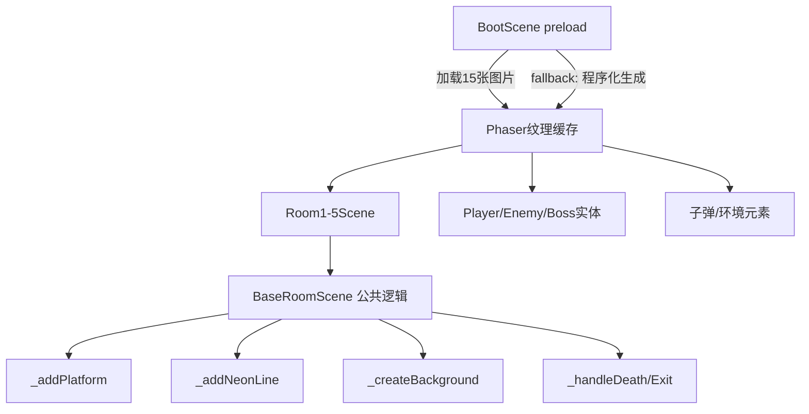

## 产品概述

星渊遗城（Phaser 3 平台动作游戏Demo）——将 assets/concept/ 目录中的15张美术资源图片集成到游戏中，替换当前BootScene中程序化生成的纯色纹理，并对代码进行全面优化。

## 核心功能

1. **美术资源加载**：在BootScene中通过Phaser的preload机制加载15张PNG图片（5角色+7环境+3弹道），替换当前Graphics程序化生成纹理的方式
2. **实体精灵替换**：角色（玩家/近战/远程/飞行/Boss）使用对应美术图片，调整显示尺寸与碰撞体适配
3. **环境纹理替换**：平台、墙壁、尖刺、检查点、相位墙、能力拾取物、门触发器使用对应美术图片
4. **弹道特效替换**：玩家/敌人/Boss子弹使用对应弹道图片
5. **代码优化**：消除重复代码、统一Room场景公共逻辑、优化性能、改进错误处理

## 技术栈

- 游戏引擎：Phaser 3.60（Arcade Physics）
- 语言：原生 JavaScript (ES Module)
- 运行环境：浏览器（HTML5 Canvas / WebGL）
- 资源路径：`../assets/concept/` 相对于 `星渊遗城Demo/` 目录

## 实现方案

### 核心策略

将BootScene从"纯程序化生成纹理"改为"加载外部图片资源 + fallback保留程序化生成"。由于各实体和场景已经通过纹理key引用（如`'player'`、`'platform'`等），只需在preload中用相同的key加载图片即可自动替换，无需修改实体和场景的引用代码。

### 关键技术决策

1. **图片加载而非纹理生成**：BootScene新增`preload()`方法，使用`this.load.image(key, path)`加载15张图片，key与现有`generateTexture`的key完全一致。当图片加载成功后，`generateTexture`不再覆盖同名key的纹理（Phaser 3中`load.image`优先级高于`generateTexture`）。
2. **Fallback机制**：在`create()`中检查纹理是否已存在，仅对未加载成功的纹理执行程序化生成，确保即使图片缺失游戏也能正常运行。
3. **图片尺寸适配**：美术图片原始尺寸远大于游戏内尺寸（如player.png 664KB vs 游戏内28x44），需要在实体创建后用`setDisplaySize()`或`setScale()`调整到Constants.js中定义的尺寸，同时保持碰撞体不变。
4. **路径映射**：图片文件名含空格（如`enemy melee.png`），Phaser的`this.load.image()`支持URL编码路径，需使用`encodeURI`或直接用带空格的路径字符串。
5. **资源路径**：从`星渊遗城Demo/`目录出发，图片相对路径为`../assets/concept/characters/player.png`等。

### 图片与纹理Key映射表

| 纹理Key | 图片路径 |
| --- | --- |
| player | ../assets/concept/characters/player.png |
| boss | ../assets/concept/characters/boss1.png |
| enemy_melee | ../assets/concept/characters/enemy%20melee.png |
| enemy_ranged | ../assets/concept/characters/enemy%20ranged.png |
| enemy_flying | ../assets/concept/characters/enemy%20flying.png |
| platform | ../assets/concept/environment/platform.png |
| wall | ../assets/concept/environment/wall.png |
| checkpoint | ../assets/concept/environment/checkpoint.png |
| spike | ../assets/concept/environment/spike.png |
| door_trigger | ../assets/concept/environment/door_trigger.png |
| phase_wall | ../assets/concept/environment/phase_wall.png |
| ability_pickup | ../assets/concept/environment/ability_pickup.png |
| bullet_player | ../assets/concept/effects/bullet%20player.png |
| bullet_enemy | ../assets/concept/effects/bullet%20enemy.png |
| bullet_boss | ../assets/concept/effects/bullet%20boss.png |


### 实体尺寸适配策略

- Player: 原始28x44 → 加载图片后`setDisplaySize(28, 44)` + 保持碰撞体
- MeleeEnemy: 30x36 → `setDisplaySize(30, 36)`
- RangedEnemy: 28x34 → `setDisplaySize(28, 34)`
- FlyingEnemy: 26x26 → `setDisplaySize(26, 26)`
- Boss: 56x64 → `setDisplaySize(56, 64)`
- 子弹: bullet_player(10x10), bullet_enemy(8x8), bullet_boss(12x12)
- 环境: 平台/墙壁使用tileSprite自动平铺（32x32 tile），尖刺32x32，检查点12x40等

### 代码优化方向

1. **提取Room场景公共逻辑**：5个Room场景有大量重复代码（`_addPlatform`、`_addNeonLine`、`_createBackground`星空/废墟/霓虹、`_handleDeath`、摄像机设置、出口逻辑等），提取为`BaseRoomScene`基类
2. **统一敌人碰撞检测模式**：Room3/Room5中近战hitbox检测逻辑重复，可提取为工具函数
3. **优化Effects.js**：粒子效果大量使用`add.rectangle`创建临时对象，可增加对象池复用
4. **优化Constants.js**：添加图片资源路径常量，集中管理资源映射

## 实现注意事项

- **图片路径空格**：文件名含空格的路径需正确处理，Phaser 3 的 `this.load.image()` 接受相对路径字符串，空格无需额外编码
- **setDisplaySize vs setScale**：优先使用`setDisplaySize`精确控制显示像素尺寸，避免与碰撞体尺寸冲突
- **tileSprite适配**：平台和墙壁使用tileSprite平铺，图片应为可无缝平铺的纹理，若图片非32x32的tile则需确认平铺效果
- **pixelArt模式**：当前main.js中`pixelArt: false`，如果美术资源是像素风格需改为true以启用锐利缩放
- **加载进度**：可在BootScene中添加加载进度条，提升用户体验
- **fallback兼容**：保留程序化生成逻辑作为fallback，通过`this.textures.exists(key)`判断是否需要生成

## 架构设计



## 目录结构

```
星渊遗城Demo/
├── scenes/
│   ├── BootScene.js          # [MODIFY] 添加preload()加载图片，create()中添加fallback判断和加载进度条
│   ├── BaseRoomScene.js      # [NEW] Room场景基类，提取公共逻辑（平台/墙壁/背景/出口/死亡/摄像机/霓虹灯）
│   ├── Room1Scene.js         # [MODIFY] 继承BaseRoomScene，移除重复代码，仅保留特有逻辑（教学文字等）
│   ├── Room2Scene.js         # [MODIFY] 继承BaseRoomScene，移除重复代码，保留特有逻辑（尖刺、墙壁跳跃等）
│   ├── Room3Scene.js         # [MODIFY] 继承BaseRoomScene，移除重复代码，保留特有逻辑（敌人配置、碰撞设置等）
│   ├── Room4Scene.js         # [MODIFY] 继承BaseRoomScene，保留特有逻辑（相位墙、能力拾取等）
│   ├── Room5Scene.js         # [MODIFY] 继承BaseRoomScene，保留特有逻辑（Boss、竞技场等）
│   └── HUDScene.js           # [MODIFY] 轻微优化（无需大改，HUD用Canvas绘制即可）
├── entities/
│   ├── Player.js             # [MODIFY] 添加setDisplaySize适配图片尺寸
│   ├── MeleeEnemy.js         # [MODIFY] 添加setDisplaySize适配图片尺寸
│   ├── RangedEnemy.js         # [MODIFY] 添加setDisplaySize适配图片尺寸
│   ├── FlyingEnemy.js        # [MODIFY] 添加setDisplaySize适配图片尺寸
│   └── Boss.js               # [MODIFY] 添加setDisplaySize适配图片尺寸
├── utils/
│   ├── Constants.js          # [MODIFY] 添加ASSET_PATHS常量集中管理资源路径
│   └── Effects.js            # [MODIFY] 优化粒子创建，减少临时对象分配
├── managers/
│   ├── GameState.js          # [无修改]
│   ├── CheckpointManager.js  # [无修改]
│   └── AudioManager.js       # [无修改]
├── main.js                   # [MODIFY] 可选：调整pixelArt设置
└── index.html                # [无修改]
```