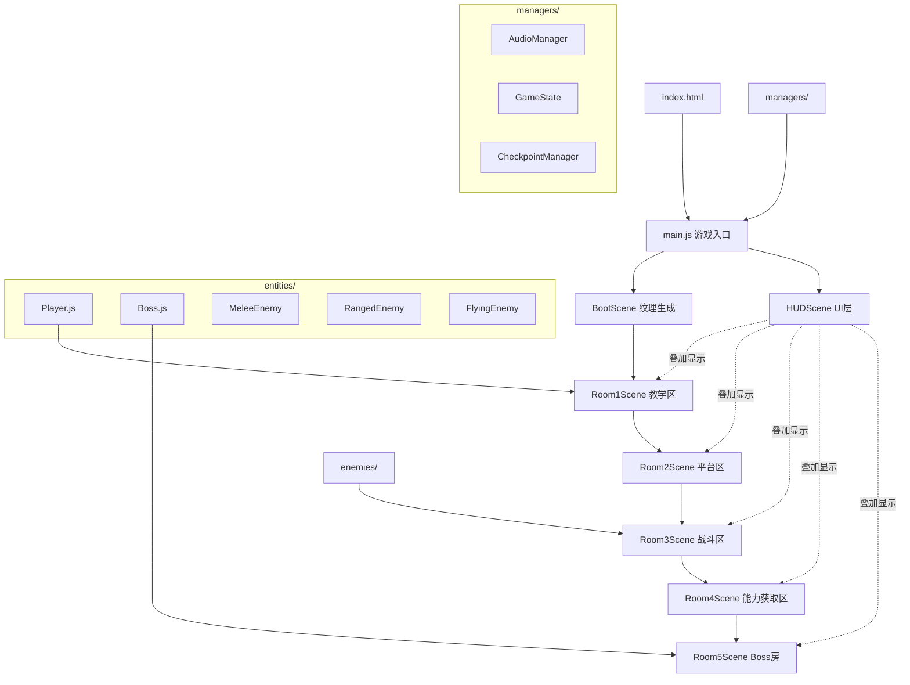

## 产品概述

《星渊遗城 Demo》是一个浏览器可运行的 2D 横版动作平台游戏原型，用于验证银河地下城类型游戏的核心体验。游戏包含 5 个连续房间，10-15 分钟可通关，重点验证移动手感、战斗反馈、关卡节奏和 Boss 战。

## 核心功能

### 玩家操作系统

- 左右移动、跳跃、二段跳、冲刺、墙滑/墙跳
- 近战攻击（能量刃）、远程攻击（脉冲手枪，消耗能量）
- 受击反馈、死亡后在最近检查点复活
- 跳跃具备 coyote time 和 jump buffer；冲刺干脆明确
- 攻击命中有停顿感(hitstop)、闪白、屏幕震动

### 关卡结构（5个连续房间）

- 房间1-出生教学区：学习移动、跳跃、攻击，有提示文字
- 房间2-平台跳跃区：练习二段跳、墙跳/墙滑，有陷阱和高低差
- 房间3-战斗区：与3类小怪战斗（近战巡逻怪、远程射击怪、飞行骚扰怪）
- 房间4-能力获取区：获得"相位冲刺"能力，随后有使用该能力的小挑战
- 房间5-Boss房：对战"相位监察者"，具备冲撞、射击/激光、瞬移突进三种攻击模式，有前摇提示、Boss血条、击败后胜利提示和剧情钩子

### 敌人系统

- 近战巡逻怪：左右巡逻，靠近玩家时冲刺攻击
- 远程射击怪：固定或缓慢移动，周期性发射弹丸
- 飞行骚扰怪：空中悬浮移动，俯冲攻击玩家

### UI系统

- 左上角玩家血量条，右上角远程能量条
- Boss战时屏幕上方显示Boss血条
- 屏幕中央显示"新能力已获得"等提示
- 死亡后显示简洁重生提示

### 其他功能

- 检查点系统与复活机制
- 房间切换与摄像机平滑过渡
- 摄像机平滑跟随玩家
- 简单音效接口预留（结构预留，无真实音频）
- 科幻废墟风格视觉：深蓝紫配色、远景星空、几何图形占位

### 美术表现

- 所有角色、敌人、Boss、平台均使用几何图形和色块绘制
- 背景具有远景星空和废墟结构的视差层次感
- UI偏科技感，简洁清晰
- 粒子效果用于冲刺尾迹、攻击命中、Boss特效等

## 技术栈

- **游戏引擎**：Phaser 3（通过 CDN 引入，无需 npm/构建工具）
- **语言**：纯 JavaScript（ES6+ 模块化）
- **运行方式**：浏览器直接打开 index.html（需本地 HTTP 服务器加载 ES Module）
- **资源方案**：全部使用 Phaser Graphics API 绘制几何图形，零外部图片依赖
- **模块加载**：ES Module（type="module"），每个功能一个独立 JS 文件

## 实现方案

### 整体架构

采用 Phaser 3 的 Scene 机制作为核心架构。每个游戏房间对应一个独立 Scene，通过 Scene 切换实现房间推进。玩家、敌人、Boss 均采用简单的有限状态机（FSM）管理行为状态。所有视觉元素通过 Phaser 的 Graphics API 在运行时生成纹理（generateTexture），避免任何外部资源依赖。

### 关键技术决策

1. **角色控制器设计**：不使用 Phaser 内置 Arcade Physics 的默认角色控制，而是在 Arcade Physics 基础上自定义速度控制逻辑，以实现 coyote time、jump buffer、墙滑/墙跳等高级手感特性。这比纯物理模拟更可控。

2. **状态机模式**：玩家和 Boss 使用轻量 FSM（一个 state 字符串 + switch/case），不引入复杂状态机库。状态包括 idle/run/jump/fall/dash/wallslide/attack/hit/dead 等。简单直接，调试方便。

3. **房间系统**：每个房间是一个独立的 Phaser Scene。房间切换时启动新 Scene 并传递玩家数据（HP、能量、已获能力）。使用 scene.launch + scene.stop 模式。HUD 作为独立 Scene 叠加在游戏 Scene 之上，避免每个房间重复创建 UI。

4. **碰撞与伤害**：使用 Arcade Physics 的 overlap 检测攻击判定，collider 检测平台碰撞。攻击时创建临时的攻击判定矩形（hitbox），存在几帧后销毁。

5. **视觉反馈系统**：

- Hitstop：命中时暂停游戏物理 50-80ms（scene.physics.pause + timer resume）
- 闪白：命中时将 sprite tint 设为 0xFFFFFF 持续 2 帧
- 屏幕震动：camera.shake(100, 0.005)
- 冲刺拖影：通过定时创建半透明残影实现

6. **Boss AI**：三阶段设计对应血量阈值（100%-60%、60%-30%、30%-0%），每个阶段逐步增加攻击模式的频率和复杂度。使用计时器驱动攻击循环，状态机控制行为切换。

7. **纹理生成方案**：在 Boot/Preload Scene 中使用 Graphics 对象绘制所有需要的图形（玩家方块、敌人形状、平台色块、子弹圆形等），通过 generateTexture() 生成纹理 key，后续用 sprite 引用。这样既保持模块化又有良好性能。

## 实现要点

### 手感调优参数（核心）

- 移动速度：200-250 px/s，加速/减速需平滑（lerp）
- 跳跃：初速 -400，gravity 800-1000，按键时长影响跳跃高度（短按截断速度）
- Coyote time：离开平台后 80-120ms 内仍可跳跃
- Jump buffer：落地前 100ms 内按跳跃键自动触发跳跃
- 冲刺：瞬间速度 500-600，持续 150ms，冷却 300ms，冲刺期间禁用重力
- 墙滑：接触墙壁时下落速度限制为 100 px/s
- 墙跳：离墙方向 250 + 向上 -350 的速度组合

### 性能注意

- 攻击 hitbox 必须及时销毁，避免累积
- 敌人和弹幕需要对象池或离屏回收
- Boss 房弹幕密集时控制同屏弹幕数量上限（建议 20-30）
- 背景视差用 tileSprite 或 camera scrollFactor，不创建多余对象

### 音效预留

- 创建 AudioManager 模块，暴露 play(soundKey) 接口
- 内部维护 sound key 映射，当前全部为空操作（no-op）
- 后续替换真实音频只需注册 key 对应的音频文件

## 架构设计



### 数据流

1. **游戏状态流**：GameState（单例）保存玩家 HP、能量、已获能力、当前检查点 → 房间切换时读取/写入 → HUDScene 监听变化更新显示
2. **战斗流**：攻击动作 → 创建 hitbox → overlap 检测 → 命中回调 → 扣血 + 视觉反馈 → 状态检查（死亡/阶段切换）
3. **房间切换流**：玩家触碰房间右边界触发器 → 保存状态 → stop 当前 Scene → start 下一 Scene → HUD 保持

## 目录结构

```
c:/Users/Administrator/Desktop/游戏/星渊遗城Demo/
├── index.html                    # [NEW] 入口 HTML 文件。引入 Phaser 3 CDN，加载 main.js 作为 ES Module 入口。设置全屏深色背景和 canvas 居中样式。
├── main.js                       # [NEW] 游戏主入口。创建 Phaser.Game 实例，配置 Arcade Physics、画布尺寸(1024x640)、像素风格渲染，注册所有 Scene。
├── scenes/
│   ├── BootScene.js              # [NEW] 启动场景。使用 Graphics API 生成所有游戏纹理（玩家、敌人、平台、子弹、Boss、特效粒子等），完成后自动进入 Room1。
│   ├── Room1Scene.js             # [NEW] 房间1-教学区。创建基础平台布局，放置教学提示文字（移动/跳跃/攻击），设置检查点，生成远景星空背景。玩家在此学习基础操作。
│   ├── Room2Scene.js             # [NEW] 房间2-平台跳跃区。设计高低差平台、墙壁（供墙跳/墙滑练习）、简单尖刺陷阱。重点验证二段跳和墙跳手感。
│   ├── Room3Scene.js             # [NEW] 房间3-战斗区。部署3类敌人（近战巡逻怪x2、远程射击怪x1、飞行骚扰怪x1），设计适合战斗的平台布局，设置检查点。
│   ├── Room4Scene.js             # [NEW] 房间4-能力获取区。放置能力获取道具，触发"相位冲刺已获得"提示。后半段设计需要相位冲刺才能通过的障碍（相位墙）。
│   ├── Room5Scene.js             # [NEW] 房间5-Boss房。实现"相位监察者"Boss 战。包含 Boss AI（三种攻击模式+三阶段）、Boss 血条、战斗竞技场平台布局、击败后胜利界面和剧情钩子文字。
│   └── HUDScene.js               # [NEW] HUD 叠加场景。左上角玩家血量条、右上角能量条、Boss 血条（仅 Room5 显示）、屏幕中央提示文字系统、死亡重生提示。作为独立 Scene 叠加运行。
├── entities/
│   ├── Player.js                 # [NEW] 玩家类。继承 Phaser.Physics.Arcade.Sprite。实现完整状态机（idle/run/jump/fall/dash/wallslide/attack_melee/attack_ranged/hit/dead）。包含 coyote time、jump buffer、墙滑/墙跳、冲刺（含相位冲刺升级）、近战 hitbox 生成、远程弹丸发射、受击闪白、死亡处理。暴露统一接口供 Scene 调用。
│   ├── MeleeEnemy.js             # [NEW] 近战巡逻怪。左右巡逻移动，检测到玩家进入范围后冲向玩家执行近战攻击，有攻击冷却。被击中闪白，死亡播放简单消散效果。
│   ├── RangedEnemy.js            # [NEW] 远程射击怪。缓慢巡逻或固定位置，周期性向玩家方向发射弹丸。弹丸有存活时间限制。被击中有后退效果。
│   ├── FlyingEnemy.js            # [NEW] 飞行骚扰怪。在空中按正弦波轨迹移动，周期性俯冲向玩家位置攻击，俯冲后返回空中。不受重力影响。
│   └── Boss.js                   # [NEW] 相位监察者 Boss。三阶段 AI 状态机：阶段1（冲撞为主）、阶段2（增加射击/激光）、阶段3（增加瞬移突进，攻击更频繁）。每个攻击有明确前摇动画（颜色/大小变化）、攻击判定、恢复期。管理自身血量和阶段切换逻辑。
├── managers/
│   ├── GameState.js              # [NEW] 全局游戏状态管理器。存储玩家 HP、最大 HP、能量、最大能量、已解锁能力列表、当前检查点（房间+位置）、Boss 战状态。提供存取接口和事件通知。
│   ├── AudioManager.js           # [NEW] 音效管理器。预留 play(key)、stopAll()、setVolume() 接口。内部维护音效 key 到 sound 对象的映射，当前为空操作。后续接入真实音频只需加载资源并注册。
│   └── CheckpointManager.js     # [NEW] 检查点管理器。记录最近激活的检查点（房间 Scene key + 坐标），提供保存/读取/复活功能。复活时重启对应 Scene 并将玩家放置在检查点位置。
├── utils/
│   ├── Constants.js              # [NEW] 全局常量。物理参数（重力、移动速度、跳跃力等）、手感参数（coyote time、jump buffer 时长等）、游戏配置（画布尺寸、房间数等）、颜色定义。集中管理便于调优。
│   └── Effects.js                # [NEW] 视觉效果工具。提供 hitstop（暂停+恢复）、screenShake（摄像机震动）、flashWhite（sprite 闪白）、spawnParticles（简单粒子爆发）、createAfterimage（冲刺残影）等静态方法。
└── 策划案.txt                     # [已有] 完整商业策划案文档（不修改）
```

## 关键代码结构

### 玩家状态机接口

```javascript
// Player.js 核心结构
class Player extends Phaser.Physics.Arcade.Sprite {
    // 状态枚举
    static States = {
        IDLE: 'idle', RUN: 'run', JUMP: 'jump', FALL: 'fall',
        DASH: 'dash', WALL_SLIDE: 'wall_slide', 
        ATTACK_MELEE: 'attack_melee', ATTACK_RANGED: 'attack_ranged',
        HIT: 'hit', DEAD: 'dead'
    };
    
    // 手感关键属性
    coyoteTimer;      // 离开平台后的宽容时间计时
    jumpBufferTimer;  // 落地前预输入跳跃计时
    canDoubleJump;    // 二段跳可用标记
    dashCooldownTimer;// 冲刺冷却计时
    hasPhaseShift;    // 是否已获得相位冲刺能力

    update(time, delta) {}       // 主更新：输入处理 + 状态机驱动
    takeDamage(amount, knockbackDir) {} // 受击接口
    respawnAt(x, y) {}           // 检查点复活
}
```

### Boss AI 接口

```javascript
// Boss.js 核心结构
class Boss extends Phaser.Physics.Arcade.Sprite {
    static Phases = { PHASE1: 1, PHASE2: 2, PHASE3: 3 };
    static Attacks = { CHARGE: 'charge', SHOOT: 'shoot', TELEPORT: 'teleport' };
    
    currentPhase;     // 当前阶段（根据血量百分比切换）
    attackCooldown;   // 攻击间隔计时
    isAttacking;      // 是否在攻击动作中
    isVulnerable;     // 是否可被伤害（前摇/恢复期不可中断）

    update(time, delta) {}       // AI 决策 + 攻击执行
    takeDamage(amount) {}        // 受击 + 阶段检查
    executeCharge() {}           // 冲撞攻击
    executeShoot() {}            // 射击/激光攻击  
    executeTeleport() {}         // 瞬移突进攻击
}
```

## 使用的扩展

### SubAgent

- **code-explorer**
- 用途：在实现过程中如需参考策划案细节或检查已生成代码的一致性时，用于快速搜索项目文件
- 预期结果：准确定位策划案中的具体设计参数和已有代码模式